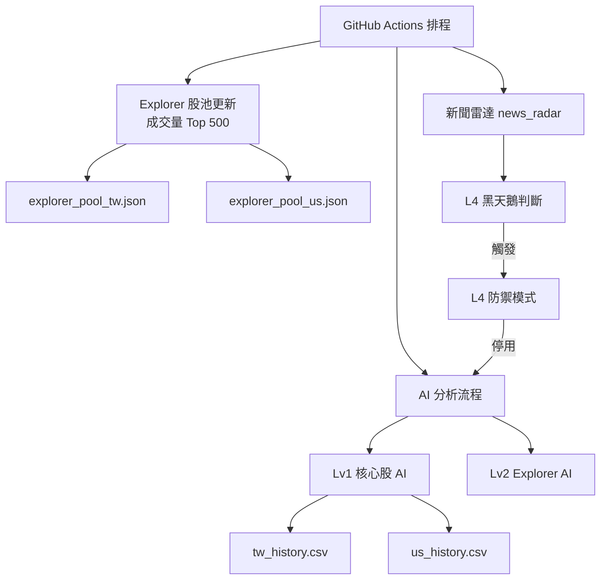

> Research-only quantitative market intelligence system.  
> No trading. No investment advice. Observation & risk monitoring only.

---

# 🧠 Stock-Genius-System
Quant Intelligence Market Monitor (v1.0-stable)

一套以「**穩定性、可觀測性、風險隔離**」為核心設計理念的量化 AI 股市研究系統。  
本專案定位為 **研究 / 觀測用途**，**非自動交易系統、非投資建議**。

---

## 🧭 專案定位（Project Positioning｜中文）

Stock-Genius-System 是一個 **研究導向的量化情報系統**，  
用於市場觀測、風險監控、模型行為與績效結構分析。

本系統具備以下明確限制：

- ❌ 不執行任何實際交易  
- ❌ 不管理任何資金  
- ❌ 不產生可執行的買賣指令  
- ❌ 不提供投資建議或報酬保證  

所有輸出僅用於 **研究、學習、與系統設計驗證**。

---

## 🧠 系統設計核心原則（中文）

### 🔒 Freeze 原則
- 預測 Horizon 固定（目前為 5 日）
- AI 不因短期績效自動調整策略
- 防止過度擬合與策略漂移

### 🧱 分層設計（Lv1 → Lv4）
- 核心預測、探索、風險、黑天鵝防禦完全解耦
- 任一層可獨立停用，不影響其他層穩定性

### 🔍 Explorer 不干擾原則
- Explorer（Lv2）僅作為潛力觀測
- 僅顯示、不寫檔
- 不影響任何系統決策與行為

### 🚨 黑天鵝優先原則
- L4 啟動時，所有 AI 分析立即停止
- 僅保留監控、紀錄與事後分析

---

## 🧩 系統分層架構說明（中文）

### Lv1 / Lv1.5｜核心監控層（穩定）
- 🇹🇼 台股核心股（如 2330、2317…）
- 🇺🇸 美股 Magnificent 7
- 固定 Horizon = 5 日
- 會寫入歷史資料（僅觀測）

### Lv2｜Explorer 探索股池（潛力觀測）
- 來源：成交量 Top 500（每週自動更新）
- AI 使用流程：
  - 只讀股池
  - 篩選 Top 100
  - 顯示 Top 5
- ❌ 不寫入 history
- ❌ 不影響任何決策

### Lv3｜風險觀察層
- 命中率或趨勢惡化
- 系統進入「觀察期」
- 僅標示，不停機

### Lv4｜黑天鵝防禦層
- 新聞雷達觸發重大事件
- 系統全面停用 AI 行為
- 僅保留監控與事後分析

---

## 🗺 系統架構圖（Mermaid）



---

## 📂 專案目錄結構

```
Stock-Genius-System/
├─ .github/workflows/
│  └─ quant_master.yml
├─ data/
│  ├─ tw_history.csv
│  ├─ us_history.csv
│  ├─ explorer_pool_tw.json
│  ├─ explorer_pool_us.json
│  ├─ horizon_policy.json
│  ├─ l3_warning.flag
│  ├─ l4_active.flag
│  ├─ l4_last_end.flag
│  ├─ black_swan_history.csv
│  ├─ news_cache.json
│  ├─ equity_TW.png
│  └─ equity_US.png
├─ scripts/
│  ├─ ai_tw_post.py
│  ├─ ai_us_post.py
│  ├─ update_tw_explorer_pool.py
│  ├─ update_us_explorer_pool.py
│  ├─ safe_yfinance.py
│  ├─ news_radar.py
│  ├─ performance_dashboard.py
│  └─ l4_*.py
├─ requirements.txt
├─ README.md
└─ LICENSE
```

---

## 📣 Discord 輸出格式（台股 / 美股共用）

```
📊 市場 AI 進階預測報告 (YYYY-MM-DD)

🔍 AI 海選 Top 5（Explorer 潛力股）
👁 核心監控（Lv1 / Lv1.5）

📊 近 5 日回測結算（歷史觀測）
交易筆數：XX
命中率：XX%
平均報酬：+X.XX%
最大回撤：-X.XX%

📌 本結算僅為歷史統計觀測，不影響任何即時預測或系統行為
💡 模型為機率推估，僅供研究參考，非投資建議
```

---

## ⚠️ 免責聲明（中文）

本專案僅供 **研究與學習用途**：

- 非投資建議  
- 非自動交易系統  
- 不保證任何報酬  

使用者需自行承擔所有市場與使用風險。

---

# =========================
# English Version
# =========================

## Project Positioning (English)

Stock-Genius-System is a **research-oriented quantitative intelligence system**
designed for market observation, risk monitoring, and model behavior analysis.

This project:

- Does NOT execute trades  
- Does NOT manage capital  
- Does NOT provide investment or trading advice  

All outputs are **observational and probabilistic**, intended solely for
research, learning, and system design experimentation.

---

## Core Design Principles (English)

### Freeze Principle
- Prediction horizon is fixed (currently 5 days)
- No automatic strategy adaptation based on short-term performance
- Prevents overfitting and strategy drift

### Layered Architecture (Lv1–Lv4)
- Core prediction, exploration, risk monitoring, and black swan defense
  are fully decoupled
- Each layer can be independently disabled

### Explorer Non-Interference
- Explorer (Lv2) is display-only
- Read-only, no history write-back
- No impact on system decisions

### Black Swan First
- When L4 is triggered, all AI actions are halted immediately
- Only monitoring and post-event analysis remain active

---

## Disclaimer (English)

This software is provided **for research and educational purposes only**.

All outputs generated by this system are probabilistic observations based on
historical data and machine learning models. They do **NOT** constitute
investment advice, financial advice, trading recommendations, or solicitation.

The author assumes **no responsibility or liability** for any financial losses,
damages, or decisions made based on the use of this software.

Users are solely responsible for understanding the risks associated with
financial markets and for complying with all applicable laws and regulations
in their respective jurisdictions.

---

### Legal Notice

This repository is licensed under a **Research-Only Software License**.

Any use of this project for real-world trading, investment decision-making,
commercial services, or financial advice is strictly prohibited.

See the LICENSE file for full legal terms.
