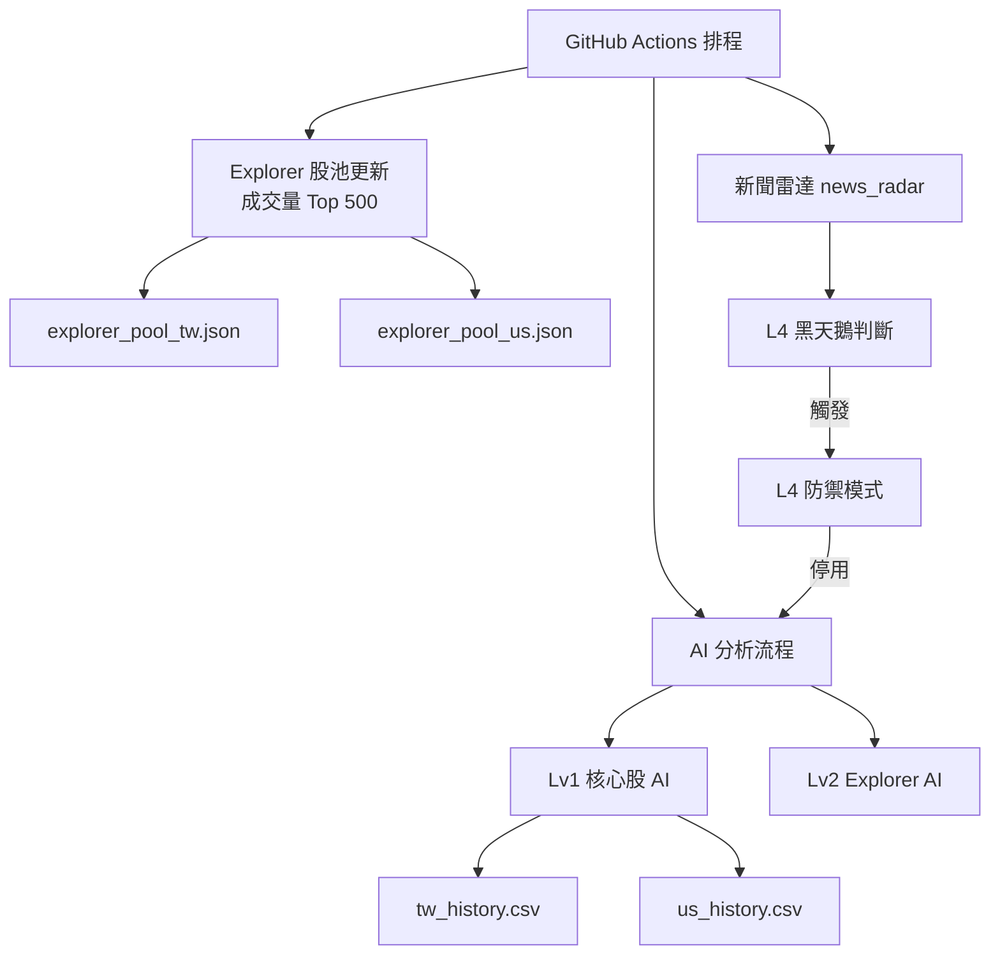

## Project Positioning

Stock-Genius-System is a research-oriented quantitative intelligence system
designed for market observation, risk monitoring, and model performance analysis.

This project does NOT execute trades, manage capital, or provide actionable
investment instructions. All outputs are observational in nature and intended
to support research, learning, and system design experimentation.
---


# 📊 Stock-Genius-System

一套 **以穩定性、可觀測性、風險隔離為核心設計理念** 的量化 AI 股市研究系統。
本專案定位為 **研究 / 觀測用途**，非自動交易系統。

---

## 🧠 系統設計核心原則

* **Freeze 原則**：

  * 預測 Horizon 固定（目前為 5 日）
  * AI 不因短期績效自動調整策略

* **分層設計（Lv1 → Lv4）**：

  * 核心預測、探索、風險、防禦完全解耦

* **Explorer 不干擾原則**：

  * 探索池僅顯示、不寫檔、不影響任何系統行為

* **黑天鵝優先原則**：

  * L4 啟動時，所有 AI 行為立即停止

---

## 🧩 系統分層架構

### Lv1 / Lv1.5｜核心監控（穩定）

* 🇹🇼 台股核心股（如：2330、2317…）
* 🇺🇸 美股 Magnificent 7
* 固定 Horizon = 5 日
* 會寫入歷史資料（僅觀測）

### Lv2｜Explorer 探索股池（潛力觀測）

* 來源：成交量 Top 500（每週自動更新）
* AI 使用時：

  * 只讀股池
  * 篩選 Top 100
  * 顯示 Top 5
* ❌ 不寫入 history
* ❌ 不影響任何決策

### Lv3｜風險觀察層

* 命中率趨勢惡化
* 系統進入 **觀察期（L3）**
* 僅標示、不停機

### Lv4｜黑天鵝防禦層

* 新聞雷達觸發重大事件
* 系統全面停用 AI 行為
* 僅保留監控與紀錄

---

## 🗺 系統架構圖（Mermaid）



---

## 📂 專案目錄結構

```
Stock-Genius-System/
│
├─ .github/workflows/
│  └─ quant_master.yml        # GitHub Actions 主控排程
│
├─ data/
│  ├─ tw_history.csv          # 台股歷史預測（僅觀測）
│  ├─ us_history.csv          # 美股歷史預測（僅觀測）
│  ├─ explorer_pool_tw.json   # 🇹🇼 Explorer 股池（Top 500）
│  ├─ explorer_pool_us.json   # 🇺🇸 Explorer 股池（Top 500）
│  ├─ horizon_policy.json     # Horizon Freeze 設定
│  ├─ l3_warning.flag         # L3 風險觀察期
│  ├─ l4_active.flag          # L4 黑天鵝啟動
│  ├─ l4_last_end.flag        # 最近一次 L4 結束時間
│  ├─ black_swan_history.csv  # 黑天鵝事件紀錄
│  ├─ news_cache.json         # 新聞快取
│  ├─ equity_TW.png           # 台股 Equity Curve
│  └─ equity_US.png           # 美股 Equity Curve
│
├─ scripts/
│  ├─ ai_tw_post.py           # 🇹🇼 台股 AI 分析 + Discord
│  ├─ ai_us_post.py           # 🇺🇸 美股 AI 分析 + Discord
│  ├─ update_tw_explorer_pool.py # 台股 Explorer 更新
│  ├─ update_us_explorer_pool.py # 美股 Explorer 更新
│  ├─ safe_yfinance.py        # Yahoo Finance 安全封裝
│  ├─ news_radar.py           # 新聞雷達 / 黑天鵝偵測
│  ├─ performance_dashboard.py# 績效統計（觀測）
│  └─ l4_*.py                 # L4 黑天鵝模組群
│
├─ requirements.txt
├─ README.md
└─ LICENSE
```

---

## 📣 Discord 輸出格式（台 / 美共用）

```
📊 市場 AI 進階預測報告 (YYYY-MM-DD)
------------------------------------------

🔍 AI 海選 Top 5（潛力股）
（Explorer 股池）

👁 核心監控（固定顯示）
（Lv1 / Lv1.5）

------------------------------------------
📊 近 5 日回測結算（歷史觀測）

交易筆數：XX
命中率：XX%
平均報酬：+X.XX%
最大回撤：-X.XX%

📌 本結算僅為歷史統計觀測，不影響任何即時預測或系統行為

💡 模型為機率推估，僅供研究參考，非投資建議。
```

---

## ⚠️ 免責聲明

本專案為 **研究與學習用途**：

* ❌ 非投資建議
* ❌ 非自動交易系統
* ❌ 不保證任何報酬

使用者須自行承擔所有投資與使用風險。

---

## 🏁 專案狀態

* 系統架構：✅ 穩定
* Explorer 機制：✅ 上線
* 風險防禦（L4）：✅ 完整
* Horizon 策略：🔒 Freeze

**本系統可長期自動運行，適合持續觀測與研究。**
## Disclaimer

本系統所有輸出僅為 **研究與技術觀測用途**，  
不構成任何投資建議或買賣依據。  
使用者需自行承擔所有市場風險。

## Disclaimer

This project is provided for research and educational purposes only.

All outputs generated by this system are probabilistic observations based on
historical data and machine learning models. They do NOT constitute investment
advice, financial advice, trading recommendations, or any form of solicitation.

The author assumes no responsibility or liability for any financial losses,
damages, or decisions made based on the use of this software.

Users are solely responsible for understanding the risks associated with
financial markets and for complying with all applicable laws and regulations
in their respective jurisdictions.
